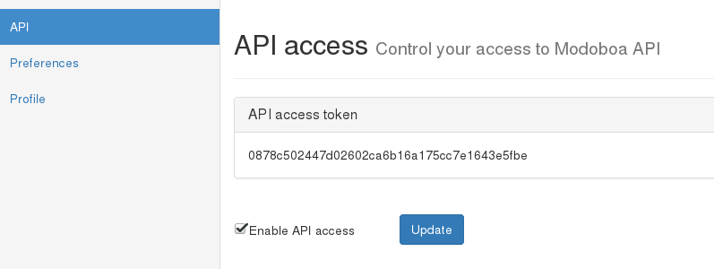

########
REST API
########

To ease the integration with external sources (software or other),
Modoboa provides a REST API.

Every installed instance comes with a ready-to-use API and a
documentation. You will find them using the following url patterns:

* API: *http://<hostname>/api/v1/*
* Documentation: *http://<hostname>/docs/api/*

An `example <https://demo.modoboa.org/docs/api/>`_ of this
documentation is available on the official demo.

Using this API requires an authentication and for now, only a token
based authentication is supported. To get a valid token, log-in to
your instance with a super administrator, go to *Settings > API* and
activate the API access. Press the Update button and wait until the
page is reloaded, the token will be displayed.

To make valid API calls, every requests you send must embed this token
within an Authorization HTTP header like this::

  Authorization: Token <YOUR_TOKEN>

and the content type of those requests must be ``application/json``.
